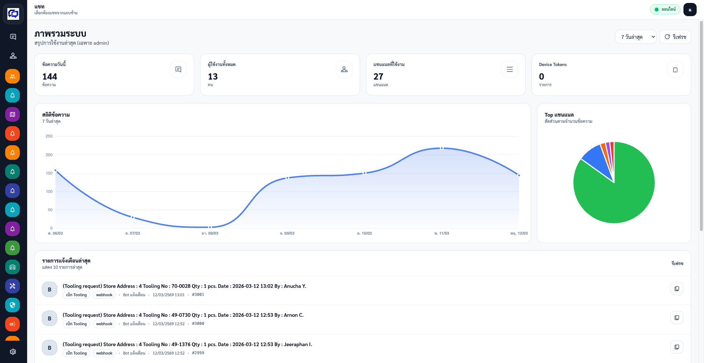
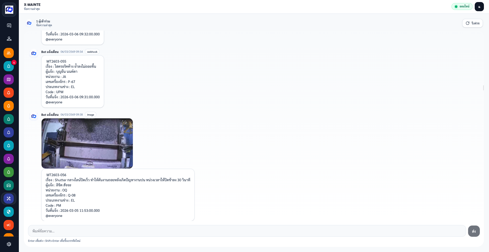
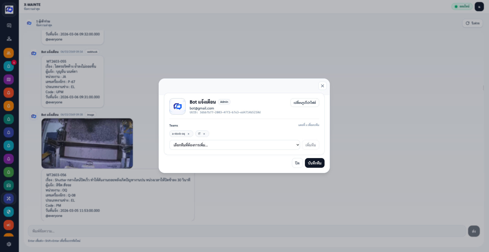
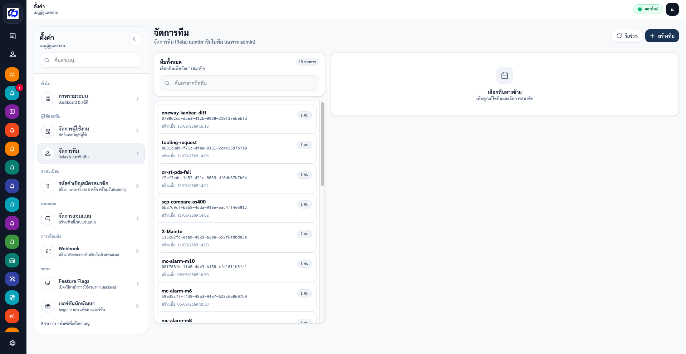
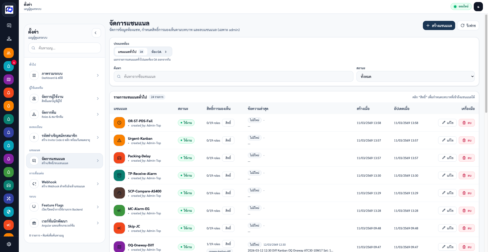

# web-notify

Frontend (Angular) สำหรับระบบ Notify-ATC

## Screenshots Web


  
  
  
  
  


## Quickstart

- Node.js + npm (repo ใช้ `npm@10.x`)

```bash
cd web-notify
npm install
npm run start
```

Dev server: `http://localhost:4200`

```bash
cd web-notify
npm run build
```

## Config (API Base URL)

ค่า API base URL ถูกกำหนดผ่าน Angular environments:

- Development: `src/environments/environment.ts`
- Production: `src/environments/environment.production.ts`

โดย `angular.json` จะใช้ `fileReplacements` ตอน build production ให้อัตโนมัติ

## Admin

- Routes หลัก: `/admin/dashboard`, `/admin/users`, `/admin/channels`, `/admin/teams`

## Notes

- `MaterialIcons-Regular.otf` ใช้เพื่อให้ `icon_codepoint` ตรงกับ Flutter
- Assets: `public/` และ `src/assets/` (ดู `web-notify/angular.json`)
